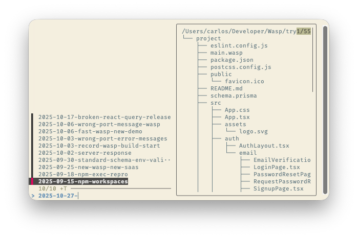
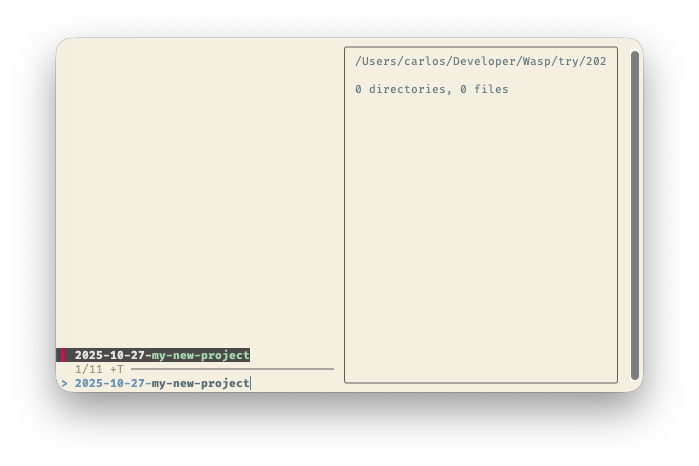
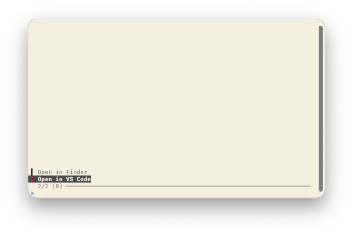

# try

> A rewrite of the Ruby-based [`try`](https://github.com/tobi/try/) into Bash
> and fzf.

Quickly create and open your scratchpad projects from the terminal.

## Usage

```bash
try
```



> Select a new project with the arrow keys or by doing a fuzzy search.

You will be prompted to select one of your old scratchpad projects (if any), or
create a new one by typing a quick description. The default location is
`$HOME/try`, but you can [customize it](#try_dir).



> Create a new project by typing a quick name for it.

Once selected, you can choose which action to perform on the selected project:



> Just choose one with your arrow keys and hit Enter, or select multiple with
> the TAB key and hit Enter.

We include some built-in actions like opening the project in your default editor
and opening an explorer window, but you can
[add your own custom actions](#try_actions_file) as well.

## Requirements

- `fzf`
- `tree`

## Installation

### With a shell package manager

Check your package manager for instructions on how to clone a Git repository.

For example, for [Antidote](https://antidote.sh/), add the following into your
configuration file:

```diff
+cprecioso/try kind:path
```

### Manual installation

1. Clone this repository
2. Add the cloned script to your `PATH`
3. _(Optional)_ Configure environment variables as needed (see
   [Configuration](#configuration))
4. Ready!

## Configuration

You can configure `try` by setting the following environment variables:

### `TRY_DIR`

Directory where scratchpad projects will be created. Default is `$HOME/try`.

### `TRY_ACTIONS_FILE`

Path to a custom actions file. By default, it uses the built-in actions located
at [`lib/actions/`](./lib/actions/).

If you want to use your own actions, make sure the file you provide exports an
`actions` array variable with the same format as the built-in actions, and the
corresponding functions.
